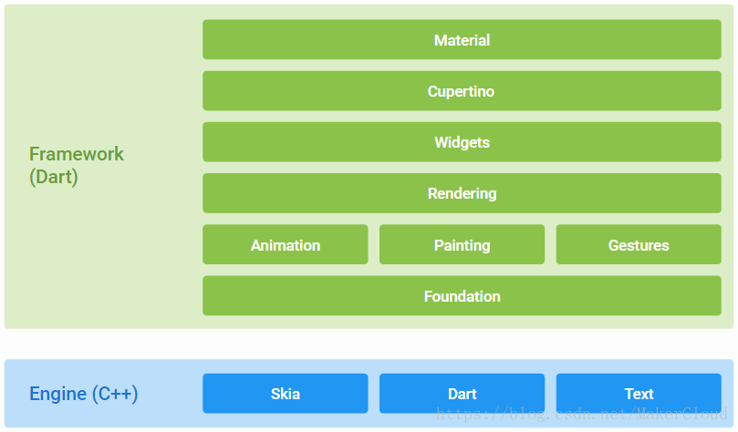

# Flutter Plugin  预习资料

[TOC]

## 前言
在Flutter中，如果我们需要打印日志，如果不进行自定义，我们只能使用自带的print()或者debugPrint()方法进行打印，
但是这两种打印，日志都是默认Info层级的日志，很不友好，所以如果需要日志打印层级分明，我们就需要自定义一个
日志打印组件，但是我希望这个打日志的组件也可以以后在其他项目里直接拿来使用.这就需要我们来开发一个日志的插件了，
再比如我们想在Flutter里面获取Android设备的信息，或者就是想用Native实现一个功能，然后能在Flutter里面使用. 等等...


## 什么是插件
在flutter中，一个插件叫做一个package，使用packages的目的就是为了达到模块化，可以创建出可被复用和共享的代码，
这和大多数编程语言中的模块、包的概念相同。创建出来的package可以在pubspec.yaml中直接依赖。

一个最小化的package包含了两部分： 
* 一个pubspec.yaml文件：一个元数据文件，声明了声明了package的名称、版本、作者等信息。

* 一个lib文件夹：包含里package的公开代码，文件夹至少需要存在<pakcage-name>.dart这个文件。
> 注意：<pakcage-name>.dart这个文件必须存在，因为这是方便使用的人快速import这个package来使用它，可以把它理解成一种必须要遵守的规则。

### package的种类
package可以分为两种：纯dart代码的package和带有特定平台代码的package。
    
* Dart packages：这是一个只有dart代码的package，里面包含了flutter的特定功能，所以它依赖于flutter的framework，也决定了它只能用在flutter上。
* plugin packages：这是一个既包含了dart代码编写的api，又包含了平台（Android/IOS）特定实现的package，可以被Android和ios调用。
> 上面应该很好理解，可以理解成java jar包和Android sdk的区别。而要开发的日志插件就是第二种。

## 开发步骤
### 开发 Dart packages
要创建Dart包，请使用--template=package 来执行 flutter create

```flutter create --template=package hello```

这将在hello/文件夹下创建一个具有以下专用内容的package工程：

* ```lib/hello.dart:```
    * Package的Dart代码
* ```test/hello_test.dart:```
    * Package的单元测试代码.
* 实现package
    * 对于纯Dart包，只需在主lib/<package name>.dart文件内或lib目录中的文件中添加功能 。
    * 要测试软件包，请在test目录中添加unit tests。
    
### 开发 plugin packages
#### Step 1: 创建 package
* 要创建插件包，请使用```--template=plugin```参数执行```flutter create```

* 使用--org选项指定您的组织，并使用反向域名表示法。该值用于生成的Android和iOS代码中的各种包和包标识符。

```flutter create --org com.example --template=plugin hello```
* 这将在hello/文件夹下创建一个具有以下专用内容的插件工程：

* lib/hello.dart:
    * 插件包的Dart API.
* android/src/main/java/com/yourcompany/​hello/HelloPlugin.java:
    * 插件包API的Android实现.
* ios/Classes/HelloPlugin.m:
    * 插件包API的ios实现.
* example/:
    * 一个依赖于该插件的Flutter应用程序，来说明如何使用它
默认情况下，插件项目针对iOS代码使用Objective-C，Android代码使用Java。如果您更喜欢Swift或Kotlin，则可以使用-i 或 -a 为iOS或Android指定语言。例如：

```flutter create --template=plugin -i swift -a kotlin hello```

#### Step 2: 实现包 package
* 由于插件包中包含用多种编程语言编写的多个平台的代码，因此需要一些特定的步骤来确保顺畅的体验。

* Step 2a: 定义包API（.dart）
插件包的API在Dart代码中定义。打开主文件夹hello/ 。找到lib/hello.dart

* Step 2b: 添加Android平台代码（.java / .kt）
我们建议您使用Android Studio编辑Android代码。

在Android Studio中编辑Android平台代码之前，首先确保代码至少已经构建过一次（例如，从IntelliJ运行示例应用程序或在终端执行cd hello/example; flutter build apk）


1. 启动Android Studio
2. 在’Welcome to Android Studio’对话框选择 ‘Import project’, 或者在菜单栏 ‘File > New > Import Project…‘,然后选择hello/example/android/build.gradle文件.
3. 在’Gradle Sync’ 对话框, 选择 ‘OK’.
4. 在’Android Gradle Plugin Update’ 对话框, 选择 ‘Don’t remind me again for this project’.
您插件的Android平台代码位于 hello/java/com.yourcompany.hello/​HelloPlugin.

您可以通过按下 ▶ 按钮从Android Studio运行示例应用程序.


* Step 2d: 连接API和平台代码
最后，您需要将用Dart代码编写的API与平台特定的实现连接起来。这是通过platform channels完成的。

#### 添加文档
建议将以下文档添加到所有软件包：

1. README.md:介绍包的文件
2. CHANGELOG.md 记录每个版本中的更改
3. LICENSE 包含软件包许可条款的文件

### 发布 packages
一旦你实现了一个包，你可以在Pub上发布它 ，这样其他开发人员就可以轻松使用它

在发布之前，检查```pubspec.yaml```、```README.md```以及```CHANGELOG.md```文件，以确保其内容的完整性和正确性。

然后, 运行 dry-run 命令以查看是否都准备OK了:

```flutter packages pub publish --dry-run```

最后, 运行发布命令:

```flutter packages pub publish```


## Plugin 通信原理
* 在介绍Plugin前，我们先简单了解一下Flutter：

 

* Flutter框架包括：Framework和Engine，他们运行在各自的Platform上。
* Framework是Dart语言开发的，包括Material Design风格的Widgets和Cupertino(iOS-style)风格的Widgets，以及文本、图片、按钮等基础Widgets；还包括渲染、动画、绘制、手势等基础能力。
* Engine是C++实现的，包括Skia（二维图形库）；Dart VM（Dart Runtime）；Text（文本渲染）等。
> 实际上，Flutter的上层能力都是Engine提供的。Flutter正是通过Engine将各个Platform的差异化抹平。而我们今天要讲的Plugin，正是通过Engine提供的Platform Channel实现的通信。


* Plugin其实就是一个特殊的Package。Flutter Plugin提供Android或者iOS的底层封装，在Flutter层提供组件功能，使Flutter可以较
方便的调取Native的模块。很多平台相关性或者对于Flutter实现起来比较复杂的部分，都可以封装成Plugin。其原理如下

 

通过上图，我们看到Flutter App是通过Plugin创建的Platform Channel调用的Native APIs。

#### Platform Channel：

1. Flutter App (Client)，通过MethodChannel类向Platform发送调用消息；
2. Android Platform (Host)，通过MethodChannel类接收调用消息；
3. iOS Platform (Host)，通过FlutterMethodChannel类接收调用消息。

> PS：消息编解码器，是JSON格式的二进制序列化，所以调用方法的参数类型必须是可JSON序列化的。
> PS：方法调用，也可以反向发送调用消息。
* Android Platform
    > FlutterActivity，是Android的Plugin管理器，它记录了所有的Plugin，并将Plugin绑定到FlutterView。

1. 理解Platform Channel工作原理
* Flutter定义了三种不同类型的Channel，它们分别是

* BasicMessageChannel：用于传递字符串和半结构化的信息。
* MethodChannel：用于传递方法调用（method invocation）。
* EventChannel: 用于数据流（event streams）的通信。

三种Channel之间互相独立，各有用途，但它们在设计上却非常相近。每种Channel均有三个重要成员变量：

* name:  String类型，代表Channel的名字，也是其唯一标识符。
* messager：BinaryMessenger类型，代表消息信使，是消息的发送与接收的工具。
* codec: MessageCodec类型或MethodCodec类型，代表消息的编解码器。

*  Channel name
​   一个Flutter应用中可能存在多个Channel，每个Channel在创建时必须指定一个独一无二的name，Channel之间使用name来区分彼此。当有消息从Flutter端发送到Platform端时，会根据其传递过来的channel name找到该Channel对应的Handler（消息处理器）。
* 消息信使:BinaryMessenger
* 平台通道数据类型支持和解码器
* 标准平台通道使用标准消息编解码器，以支持简单的类似JSON值的高效二进制序列化，例如 booleans,numbers, Strings, byte buffers, List, Maps（请参阅StandardMessageCodec了解详细信息）。 当您发送和接收值时，这些值在消息中的序列化和反序列化会自动进行。

下表显示了如何在宿主上接收Dart值，反之亦然：

|Dart	|Android|	iOS|
|---|---|---|
|null	|null	|nil (NSNull when nested)|
|bool	|java.lang.Boolean	|NSNumber numberWithBool:|
|int	|java.lang.Integer	|NSNumber numberWithInt:|
|int, if 32 bits not enough	|java.lang.Long	|NSNumber numberWithLong:|
|int, if 64 bits not enough	|java.math.BigInteger	|FlutterStandardBigInteger|
|double	|java.lang.Double	|NSNumber numberWithDouble:|
|String	j|ava.lang.String	|NSString|
|Uint8List	|byte[]	|FlutterStandardTypedData typedDataWithBytes:|
|Int32List	|int[]	|FlutterStandardTypedData typedDataWithInt32:|
|Int64List	|long[]	|FlutterStandardTypedData typedDataWithInt64:|
|Float64List	|double[]	|FlutterStandardTypedData typedDataWithFloat64:|
|List	|java.util.ArrayList	|NSArray|
|Map	|java.util.HashMap	|NSDictionary|


