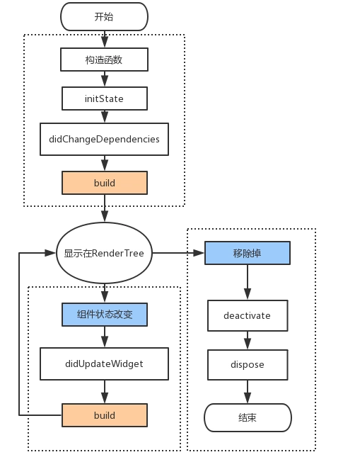
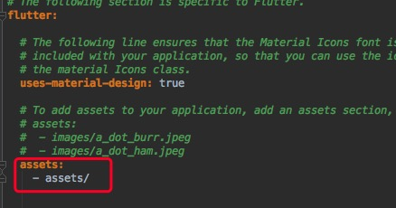
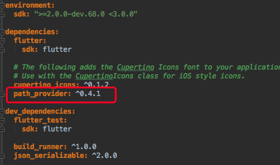
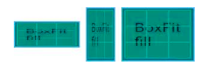
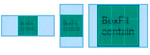
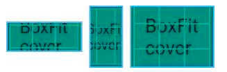
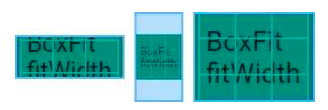
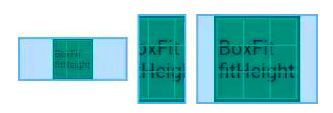
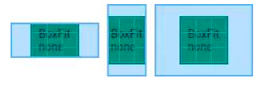
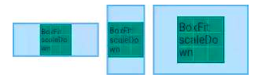

# Flutter页面-基础Widget

[TOC]

​	     在Flutter中，几乎所有的对象都是一个`Widget`，与原生开发中的**控件**不同的是，Flutter中的`widget`的概念更广泛，它不仅可以表示UI元素，也可以表示一些功能性的组件如：用于手势检测的 `GestureDetector` widget、用于应用主题数据传递的`Theme`等等。由于Flutter主要就是用于构建用户界面的，所以，在大多数时候，可以认为widget就是一个控件，不必纠结于概念。

​	Widget的功能是“描述一个UI元素的配置数据”，Widget其实并不是表示最终绘制在设备屏幕上的显示元素，而只是显示元素的一个配置数据。实际上，Flutter中真正代表屏幕上显示元素的类是`Element`，也就是说Widget只是描述`Element`的一个配置。一个Widget可以对应多个`Element`，这是因为同一个Widget对象可以被添加到UI树的不同部分，而真正渲染时，UI树的每一个节点都会对应一个`Element`对象。

​	

## Widget

`StatelessWidget`和`StatefulWidget`是`flutter`的基础组件，日常开发中自定义`Widget`都是选择继承这两者之一。也是在往后的开放中，我们最多接触的Widget：

- ​ `StatelessWidget`：无状态的，展示信息，面向那些始终不变的UI控件；

-  `StatefulWidget`：有状态的，可以通过改变状态使得 UI 发生变化，可以包含用户交互(比如弹出一个 dialog)。


在实际使用中，Stateless与Stateful的选择需要取决于这个 Widget 是有状态还是无状态，简单来说看界面是否需要更新。

### Stateless Widget

​	StatelessWidget用于不需要维护状态的场景，它通常在`build`方法中通过嵌套其它Widget来构建UI，在构建过程中会递归的构建其嵌套的Widget。

> `BuildContext`表示构建widget的上下文，它是操作widget在树中位置的一个句柄，它包含了一些查找、遍历当前Widget树的一些方法。每一个widget都有一个自己的context对象。

```dart
import 'package:flutter/material.dart';

void main() => runApp(StatelessApp());

class StatelessApp extends StatelessWidget {
  ///在build方法中通过嵌套其它Widget来构建UI，在构建过程中会递归的构建其嵌套的Widget
  @override
  Widget build(BuildContext context) {
    //嵌套 MaterialApp：封装了应用程序实现Material Design所需要的一些widget
    return MaterialApp(
        title: "Widget演示", //标题,显示在recent时候的标题
        //主页面
        //Scaffold : Material Design布局结构的基本实现。
        home: Scaffold(
          //ToolBar/ActionBar
          appBar: AppBar(title: Text("Widget")),
          body: Text("Hello,Flutter!"),
        )
    );
  }
}
```

> Material Design:
>
> 一种设计语言，Material Design 于2014年的 Google I/O 首次亮相，是谷歌推出的全新的设计语言。说白了，就是一种设计风格。

### Stateful Widget

​	   StatefulWidget是动态的，添加了一个新的接口`createState()`用于创建和Stateful widget相关的状态`State`，它在Stateful widget的生命周期中可能会被多次调用。

​	当State被改变时，可以手动调用其`setState()`方法通知Flutter framework状态发生改变，Flutter framework在收到消息后，会重新调用其`build`方法重新构建widget树，从而达到更新UI的目的。

```dart
class StatefulState extends State<StatefulApp> {
  int _i;

  ///当Widget第一次插入到Widget树时会被调用，对于每一个State对象，Flutter framework只会调用一次该回调
  @override
  void initState() {
    super.initState();
    _i = 1;
  }

  @override
  Widget build(BuildContext context) {
    return MaterialApp(
        title: "Widget演示",
        theme: ThemeData(),
        home: Scaffold(
          appBar: AppBar(title: Text("Widget")),
          body: RaisedButton(
            onPressed: () {
              //修改状态，setState会重新调用build更新ui
              setState(() {
                _i++;
              });
            },
            child: Text("Hello,Flutter! $_i"),
          ),
        ));
  }
}
```


#### State生命周期

​	State类除了`build`之外还提供了很多方法能够让我们重写，这些方法会在不同的状态下由Flutter调起执行，所以这些方法我们就称之为**生命周期**方法。

```dart
import 'package:flutter/material.dart';

void main() => runApp(MyApp());

class MyApp extends StatefulWidget {
  @override
  _MyAppState createState() => _MyAppState();
}

class _MyAppState extends State<MyApp> {
  bool isShowChild;

  ///当Widget第一次插入到Widget树时会被调用，对于每一个State对象，Flutter framework只会调用一次该回调
  @override
  void initState() {
    super.initState();
    isShowChild = true;
    debugPrint("parent initState......");
  }

  ///初始化时，在initState()之后立刻调用
  ///当依赖的InheritedWidget rebuild,会触发此接口被调用
  @override
  void didChangeDependencies() {
    super.didChangeDependencies();
    debugPrint("parent didChangeDependencies......");
  }

  ///绘制界面，当setState触发的时候会再次被调用
  @override
  Widget build(BuildContext context) {
    debugPrint("parent build......");
    return MaterialApp(
      home: Scaffold(
        body: Center(
            child: RaisedButton(
          onPressed: () {
            setState(() {
              isShowChild = !isShowChild;
            });
          },
          child: isShowChild ? Child() : Text("演示移除Child"),
        )),
      ),
    );
  }

  ///状态改变的时候会调用该方法,比如调用了setState
  @override
  void didUpdateWidget(MyApp oldWidget) {
    super.didUpdateWidget(oldWidget);
    debugPrint("parent didUpdateWidget......");
  }

  ///当State对象从树中被移除时，会调用此回调
  @override
  void deactivate() {
    super.deactivate();
    debugPrint('parent deactivate......');
  }

  ///当State对象从树中被永久移除时调用；通常在此回调中释放资源
  @override
  void dispose() {
    super.dispose();
    debugPrint('parent dispose......');
  }
}

class Child extends StatefulWidget {
  @override
  _ChildState createState() => _ChildState();
}

class _ChildState extends State<Child> {
  @override
  Widget build(BuildContext context) {
    debugPrint("child build......");
    return Text('lifeCycle');
  }

  @override
  void initState() {
    super.initState();
    debugPrint("child initState......");
  }

  ///初始化时，在initState()之后立刻调用
  ///当依赖的InheritedWidget rebuild,会触发此接口被调用
  @override
  void didChangeDependencies() {
    super.didChangeDependencies();
    debugPrint("child didChangeDependencies......");
  }

  ///父widget状态改变的时候会调用该方法,比如父节点调用了setState
  @override
  void didUpdateWidget(Child oldWidget) {
    super.didUpdateWidget(oldWidget);
    debugPrint("child didUpdateWidget......");
  }

  ///当State对象从树中被移除时，会调用此回调
  @override
  void deactivate() {
    super.deactivate();
    debugPrint('child deactivate......');
  }

  ///当State对象从树中被永久移除时调用；通常在此回调中释放资源
  @override
  void dispose() {
    super.dispose();
    debugPrint('child dispose......');
  }
}
```

执行的输出结果显示为:

- 运行到显示

```dart
I/flutter (22218): parent initState......
I/flutter (22218): parent didChangeDependencies......
I/flutter (22218): parent build......
I/flutter (22218): child initState......
I/flutter (22218): child didChangeDependencies......
I/flutter (22218): child build......
```

- 点击按钮会移除Child

```dart
I/flutter (22218): parent build......
I/flutter (22218): child deactivate......
I/flutter (22218): child dispose......
```

-  将MyApp的代码由` child: isShowChild ? Child() : Text("演示移除Child")`，改为` child: Child()`，点击按钮时

```dart
I/flutter (22765): parent build......
I/flutter (22765): child didUpdateWidget......
I/flutter (22765): child build......
```

从这些实验中能够得出State的生命周期为:




## 基础widget

### 文本显示

#### Text

`Text`是展示单一格式的文本Widget(Android `TextView`)。

```dart
import 'package:flutter/material.dart';

///
/// main方法 调用runApp传递Widget，这个Widget成为widget树的根
void main() => runApp(TextApp());

///
/// 1、单一文本Text
///
//创建一个无状态的Widget
class TextApp extends StatelessWidget {
  @override
  Widget build(BuildContext context) {
    //封装了应用程序实现Material Design所需要的一些widget
    return MaterialApp(
      title: "Text演示", //标题,显示在recent时候的标题
      //主页面
      //Scaffold : Material Design布局结构的基本实现。
      home: Scaffold(
        //ToolBar/ActionBar
        appBar: AppBar(title: Text("Text")),
        body: Text("Hello,Flutter"),
      ),
    );
  }
}
```


在使用`Text`显示文字时候，可能需要对文字设置各种不同的样式，类似Android的 `android:textColor/Size`等

在Flutter中也拥有类似的属性

```dart
Widget _TextBody() {
  return Text(
    "Hello,Flutter",
    style: TextStyle(
        //颜色
        color: Colors.red,
        //字号 默认14
        fontSize: 18,
        //粗细
        fontWeight: FontWeight.w800,
        //斜体
        fontStyle: FontStyle.italic,
        //underline：下划线，overline：上划线，lineThrough：删除线
        decoration: TextDecoration.lineThrough,
        decorationColor: Colors.black,
        //solid：实线，double：双线，dotted：点虚线，dashed：横虚线，wavy：波浪线
        decorationStyle: TextDecorationStyle.wavy),
  );
}

class TextApp extends StatelessWidget {
  @override
  Widget build(BuildContext context) {
    return MaterialApp(
      title: "Text演示", 
      home: Scaffold(
        appBar: AppBar(title: Text("Text")),
        body: _TextBody(),
      ),
    );
  }
}
```

#### RichText

如果需要显示更为丰富样式的文本(比如一段文本中文字不同颜色),可以使用`RichText`或者`Text.rich`

```dart
Widget _RichTextBody() {
  var textSpan = TextSpan(
    text: "Hello",
    style: TextStyle(color: Colors.red),
    children: [
      TextSpan(text: "Flu", style: TextStyle(color: Colors.blue)),
      TextSpan(text: "uter", style: TextStyle(color: Colors.yellow)),
    ],
  );
  //Text.rich(textSpan);
  return RichText(text: textSpan);
}
```


#### DefaultTextStyle

​	在widget树中，文本的样式默认是可以被继承的，因此，如果在widget树的某一个节点处设置一个默认的文本样式，那么该节点的子树中所有文本都会默认使用这个样式。相当于在Android中定义 Theme

```dart
Widget _DefaultStyle(){
  DefaultTextStyle(
    //设置文本默认样式
    style: TextStyle(
      color:Colors.red,
      fontSize: 20.0,
    ),
    textAlign: TextAlign.start,
    child: Column(
      crossAxisAlignment: CrossAxisAlignment.start,
      children: <Widget>[
        Text("Hello Flutter!"),
        Text("Hello Flutter!"),
        Text("Hello Flutter!",
          style: TextStyle(
              inherit: false, //不继承默认样式
              color: Colors.grey
          ),
        ),
      ],
    ),
  );
}
```


### 图片显示

"图文"：有文字显示Widget，又怎么少的了图片呢。

#### FlutterLogo

​	这个Widget用于显示Flutter的logo......

```dart
Widget flutterLogo() {
  return FlutterLogo(
    //大小
    size: 100,
    //logo颜色 默认为 Colors.blue
    colors: Colors.red,
    //markOnly：只显示logo，horizontal：logo右边显示flutter文字，stacked：logo下面显示文字
    style: FlutterLogoStyle.stacked,
    //logo上文字颜色
    textColor: Colors.blue,
  );
}
```


#### Icon	

主要用于显示内置图标的`Widget`

```dart
Widget icon() {
  return Icon(
      //使用预定义Material icons
      // https://docs.flutter.io/flutter/material/Icons-class.html
      Icons.add,
      size: 100,
      color: Colors.red);
}
```


#### Image

显示图片的`Widget`。图片常用的格式主要有bmp,jpg,png,gif,webp等，Android中并不是天生支持gif和webp动图，但是这一特性在flutter中被很好的支持了。

| 方式          | 解释                                                        |
| ------------- | ----------------------------------------------------------- |
| Image()       | 使用ImageProvider提供图片，如下方法本质上也是使用的这个方法 |
| Image.asset   | 加载资源图片                                                |
| Image.file    | 加载本地图片文件                                            |
| Image.network | 加载网络图片                                                |
| Image.memory  | 加载内存图片                                                |

##### Iamge.asset

在工程目录下创建目录，如：assets，将图片放入此目录。打开项目根目录：pubspec.yaml



```dart
return MaterialApp(
      title: "Image演示",
      home: Scaffold(
        appBar: AppBar(title: Text("Image")),
        body: Image.asset("assets/banner.jpeg"),
      ),
    );
```

##### Image.file

在sd卡中放入一张图片。然后利用**path_provider**库获取sd卡根目录(Dart库版本可以在：https://pub.dartlang.org/packages查询)。



**注意权限**

```dart
class ImageState extends State<ImageApp> {
  Image image;

  @override
  void initState() {
    super.initState();
    getExternalStorageDirectory().then((path) {
      setState(() {
        image = Image.file(File("${path.path}${Platform.pathSeparator}banner.jpeg"));
      });
    });
  }

  @override
  Widget build(BuildContext context) {
    return MaterialApp(
      title: "Image演示",
      home: Scaffold(
        appBar: AppBar(title: Text("Image")),
        body: image,
      ),
    );
  }
}
```

##### Image.network

直接给网络地址即可。

> Flutter 1.0，加载https时候经常出现证书错误。必须断开AS打开app

##### Image.memory

```dart
Future<List<int>> _imageByte() async {
  String path = (await getExternalStorageDirectory()).path;
  return await File("$path${Platform.pathSeparator}banner.jpeg").readAsBytes();
}

class ImageState extends State<ImageApp> {
  Image image;

  @override
  void initState() {
    super.initState();
    _imageByte().then((bytes) {
      setState(() {
        image = Image.memory(bytes);
      });
    });
  }

  @override
  Widget build(BuildContext context) {
    return MaterialApp(
      title: "Image演示",
      home: Scaffold(
        appBar: AppBar(title: Text("Image")),
        body: image,
      ),
    );
  }
}
```

fit属性相当于android中的scaletype，定义如下：

| fit              | 说明                                                         | 效果                                                         |
| ---------------- | ------------------------------------------------------------ | ------------------------------------------------------------ |
| BoxFit.fill      | 填充，忽略原有的宽高比，填满为止                             |      |
| BoxFit.contain   | 包含，不改变原有比例让容器包含整个图片，容器多余部分填充背景 |   |
| BoxFit.cover     | 覆盖，不改变原有比例，让图片充满整个容器，图片多余部分裁剪   |     |
| BoxFit.fitWidth  | 横向图片填充                                                 |  |
| BoxFit.fitHeight | 纵向图片填充                                                 |  |
| BoxFit.none      | 原始大小居中                                                 |      |
| BoxFit.scaleDown | 图片大小小于容器事相当于none，图片大小大于容器时缩小图片大小实现contain |  |


#### CircleAvatar

主要用来显示用户的头像，任何图片都会被剪切为圆形。

```dart
CircleAvatar(
      //图片提供者 ImageProvider
      backgroundImage: AssetImage("assets/banner.jpeg"),
      //半径，控制大小
      radius: 50.0,
    );
```


#### FadeInImage

当使用默认`Image` widget显示图片时，您可能会注意到它们在加载完成后会直接显示到屏幕上。这可能会让用户产生视觉突兀。如果最初显示一个占位符，然后在图像加载完显示时淡入，我们可以使用`FadeInImage`来达到这个目的！

```dart
 image =  FadeInImage.memoryNetwork(
      placeholder: kTransparentImage,
      image: 'https://flutter.io/images/homepage/header-illustration.png',
    );
```


### 按钮

Material widget库中提供了多种按钮Widget如RaisedButton、FlatButton、OutlineButton等，它们都是直接或间接对RawMaterialButton的包装定制，所以他们大多数属性都和`RawMaterialButton`一样。所有Material 库中的按钮都有如下相同点：

1. 按下时都会有“水波动画”。
2. 有一个`onPressed`属性来设置点击回调，当按钮按下时会执行该回调，如果不提供该回调则按钮会处于禁用状态，禁用状态不响应用户点击。


#### RaisedButton

"漂浮"按钮，它默认带有阴影和灰色背景

```dart
RaisedButton(
          child: Text("normal"),
          onPressed: () => {},
        )
```

#### FlatButton

扁平按钮，默认背景透明并不带阴影

```dart
FlatButton(
  child: Text("normal"),
  onPressed: () => {},
)
```

#### OutlineButton

默认有一个边框，不带阴影且背景透明。

```dart
OutlineButton(
  child: Text("normal"),
  onPressed: () => {},
)
```

#### IconButton

可点击的Icon

```dart
IconButton(
  icon: Icon(Icons.thumb_up),
  onPressed: () => {},
)
```


按钮外观可以通过其属性来定义，不同按钮属性大同小异

```dart
const FlatButton({
  ...  
  @required this.onPressed, //按钮点击回调
  this.textColor, //按钮文字颜色
  this.disabledTextColor, //按钮禁用时的文字颜色
  this.color, //按钮背景颜色
  this.disabledColor,//按钮禁用时的背景颜色
  this.highlightColor, //按钮按下时的背景颜色
  this.splashColor, //点击时，水波动画中水波的颜色
  this.colorBrightness,//按钮主题，默认是浅色主题 
  this.padding, //按钮的填充
  this.shape, //外形
  @required this.child, //按钮的内容
})
    
FlatButton(
  onPressed: () => {},
  child: Text("Raised"),
  //蓝色
  color: Colors.blue,
  //水波
  splashColor: Colors.yellow,
  //深色主题，这样文字颜色会变成白色
  colorBrightness: Brightness.dark,
   //圆角按钮
  shape: RoundedRectangleBorder(
      borderRadius: BorderRadius.circular(50)
  ),
)
```

而`RaisedButton`，默认配置有阴影，因此在配置`RaisedButton` 时，拥有一系列 elevation 属性的配置

```dart
const RaisedButton({
  ...
  this.elevation = 2.0, //正常状态下的阴影
  this.highlightElevation = 8.0,//按下时的阴影
  this.disabledElevation = 0.0,// 禁用时的阴影
  ...
}
```


### 输入框

```dart
import 'package:flutter/material.dart';

void main() => runApp(Demo1());

class Demo1 extends StatelessWidget {

  @override
  Widget build(BuildContext context) {
    return MaterialApp(
      title: "Demo1",
      home: Scaffold(
        appBar: AppBar(
          title: Text("登录"),
        ),
        //线性布局，垂直方向
        body: Column(
          children: <Widget>[
            TextField(
              //自动获得焦点
              autofocus: true,
              decoration: InputDecoration(
                  labelText: "用户名",
                  hintText: "用户名或邮箱",
                  prefixIcon: Icon(Icons.person)),
            ),
            TextField(
              //隐藏正在编辑的文本
              obscureText: true,
              decoration: InputDecoration(
                  labelText: "密码",
                  hintText: "您的登录密码",
                  prefixIcon: Icon(Icons.lock)),
            ),
          ],
        ),
      ),
    );
  }
}
```

这个效果非常的“系统”，我们可能大多数情况下需要将下划线更换为矩形边框，这时候可能就需要组合widget来完成:

```dart
//容器 设置一个控件的尺寸、背景、margin 
Container(
    margin: EdgeInsets.all(32),
    child: TextField(
        keyboardType: TextInputType.emailAddress,
        decoration: InputDecoration(
            labelText: "用户名",
            hintText: "用户名或邮箱",
            prefixIcon: Icon(Icons.person),
            border: InputBorder.none //隐藏下划线
            )),
    //装饰
    decoration: BoxDecoration(
      // 边框浅灰色，宽度1像素
      border: Border.all(color: Colors.red[200], width: 1.0),
      //圆角
      borderRadius: BorderRadius.circular(5.0),
    ),
  )
```


#### 焦点控制

​	FocusNode: 与Widget绑定，代表了这个Widget的焦点

​	FocusScope: 焦点控制范围

​	FocusScopeNode：控制焦点

```dart
class _TextFocusState extends State<TextFocusWidget> {
  FocusNode focusNode1 = new FocusNode();
  FocusNode focusNode2 = new FocusNode();

  void _listener() {
    debugPrint("用户名输入框焦点:${focusNode1.hasFocus}");
  }

  @override
  void initState() {
    super.initState();
    //监听焦点状态改变事件
    focusNode1.addListener(_listener);
  }

  @override
  void dispose() {
    super.dispose();
    focusNode1.dispose();
    focusNode2.dispose();
  }

  @override
  Widget build(BuildContext context) {
    return Column(
      children: <Widget>[
        TextField(
          autofocus: true,
          //关联焦点
          focusNode: focusNode1,
          //设置键盘动作为: 下一步
          textInputAction: TextInputAction.next,
          //点击下一步执行回调
          onEditingComplete: () {
            //获得 context对应UI树的焦点范围 的焦点控制器
            FocusScopeNode focusScopeNode = FocusScope.of(context);
            //将焦点交给focusNode2
            focusScopeNode.requestFocus(focusNode2);
          },
          decoration: InputDecoration(
              labelText: "用户名",
              hintText: "用户名或邮箱",
              prefixIcon: Icon(Icons.person)),
        ),
        TextField(
          //隐藏正在编辑的文本
          obscureText: true,
          focusNode: focusNode2,
          decoration: InputDecoration(
              labelText: "密码",
              hintText: "您的登录密码",
              prefixIcon: Icon(Icons.lock)),
        ),
        custom(),
      ],
    );
  }
}
```

#### 获取输入内容

获取输入内容有两种方式：

1. 定义两个变量，用于保存用户名和密码，然后在onChange触发时，各自保存一下输入内容。
2. 通过controller直接获取。


onChange获得输入内容:

```dart
TextField(
      onChanged: (s) => debugPrint("ssss:$s"),
    )
```


controller获取:

定义一个controller：

```dart
//定义一个controller
TextEditingController _unameController=new TextEditingController();
```

然后设置输入框controller：

```dart
TextField(
    controller: _unameController, //设置controller
    ...
)
```

通过controller获取输入框内容

```dart
debugPrint(_unameController.text)
```


#### TextFormField

`TextFormField`比`TextField`多了一些属性，其中 ***validator***用于设置验证回调。在单独使用时与`TextField`没有太大的区别。当结合`From`，利用`From`可以对输入框进行分组，然后进行一些统一操作(验证)

```dart
class _TextFocusState extends State<TextFocusWidget> {
  //全局key
  GlobalKey<FormState> _key = GlobalKey<FormState>();

  @override
  Widget build(BuildContext context) {
    return Form(
        //类似 id
        key: _key,
        child: Column(
          children: <Widget>[
            TextFormField(
                autofocus: true,
                decoration: InputDecoration(
                    labelText: "用户名",
                    hintText: "用户名或邮箱",
                    icon: Icon(Icons.person)),
                // 校验用户名
                validator: (v) {
                  return v.trim().length > 0 ? null : "用户名不能为空";
                }),
            TextFormField(
                decoration: InputDecoration(
                    labelText: "密码",
                    hintText: "您的登录密码",
                    icon: Icon(Icons.lock)),
                // 校验用户名
                validator: (v) {
                  return v.trim().length > 0 ? null : "密码不能为空";
                }),
            RaisedButton(
              onPressed: () {
                //Form所有TextFormField成功 返回true
                if (_key.currentState.validate()) {
                  
                }
              },
              child: Text("提交"),
            )
          ],
        ));
  }
}
```

