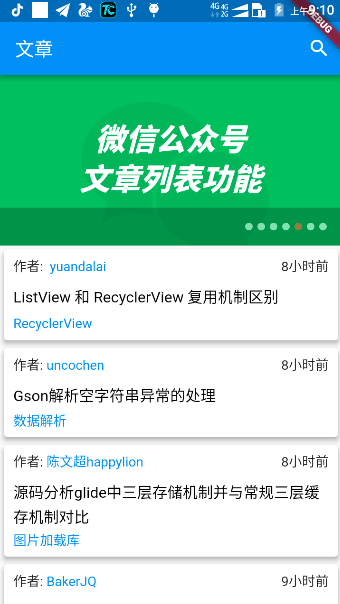
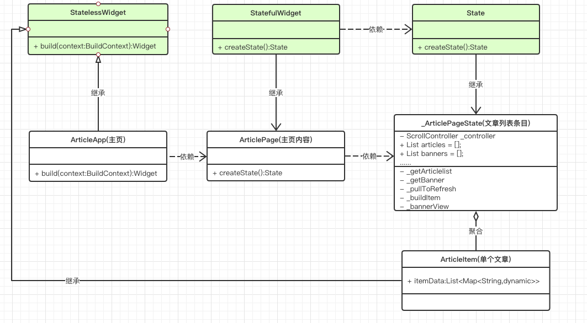
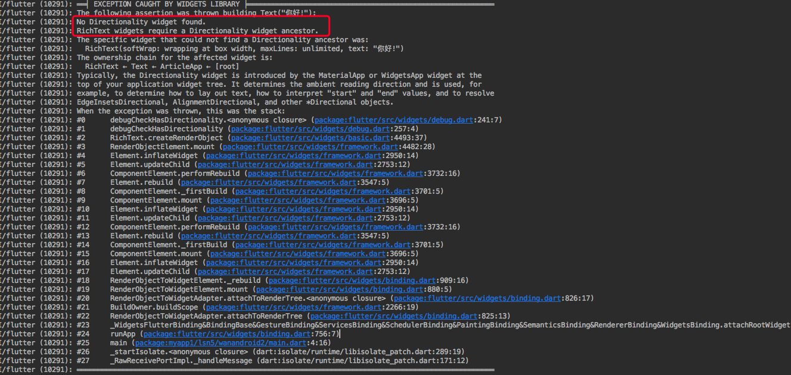
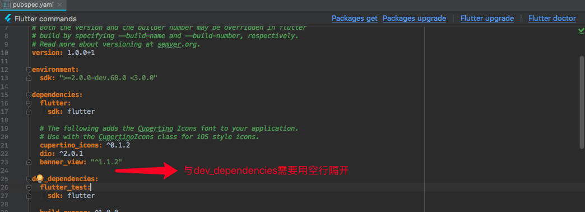

# 第一个页面

[TOC]







## 入口函数

一个Flutter工程的入口函数与Dart命令行工程一样是`main`，不同的是在Flutter中执行`runApp(ArticleApp())` 就能够在手机屏幕上展示这个Widget。

```dart
import 'package:flutter/material.dart';
void main() => runApp(new ArticleApp());
```


## ArticleApp

我们要实现的文章列表页面UI就在`ArticleApp`中定义：

```dart
class ArticleApp extends StatelessWidget {
  @override
  Widget build(BuildContext context) {
    return new MaterialApp(
      home: new Scaffold(
        appBar: new AppBar(
          title: new Text(
            '文章',
            style: const TextStyle(color: Colors.white),
          ),
        ),
        body: new ArticlePage(),
      ),
    );
  }
}

```

`build`方法中返回的就是我们需要显示在屏幕上的widget。`MaterialApp`代表使用Material Design风格，这是一个封装了很多Android MD设计所必须要的组件的小部件。假设我们需要显示一个`Text`,而没有包裹在`MaterialApp`内：

```dart
class ArticleApp extends StatelessWidget {
  @override
  Widget build(BuildContext context) {
    //Center:摆放在中间
    return Center(
      child: Text("你好!"),
    );
  }
}
```

如果直接运行则会出现异常，因为Flutter不知道以什么顺序摆放文字(从左到右/从右到左)

因此我们不得不给`Text`指名`textDirection`属性:

```dart
class ArticleApp extends StatelessWidget {
  @override
  Widget build(BuildContext context) {
    return Center(
      child: Text("你好!",
          style: const TextStyle(color: Colors.white),
          textDirection: TextDirection.ltr),
    );
  }
}
```

但是如果包含在`MaterialApp`当中我们就不需要指名类似`textDirection`这样的属性了，因为内部已经内置了一套风格，指明了这些必须属性。而`Scaffold`则实现了基本的 Material Design布局结构，在 Material 设计中定义的单个界面上的各种布局元素，在 Scaffold 中都支持。比如：AppBar、抽屉菜单、BottomNavigationBar等等。


## ArticlePage

​	在我们的布局中指定了`Scaffold`的body(主体)为`ArticlePage`，这是一个我们自定义的组合Widget。

```dart
class ArticlePage extends StatefulWidget {
  @override
  _ArticlePageState createState() => _ArticlePageState();
}

class _ArticlePageState extends State<ArticlePage> {
  ///滑动控制器
  ScrollController _controller = new ScrollController();

  ///控制小菊花的显示
  bool _isLoading = true;

  ///请求到的文章数据
  List articles = [];

  ///banner图
  List banners = [];

  ///总文章数有多少
  var listTotalSize = 0;

  ///分页加载，当前页码
  var curPage = 0;

  @override
  void initState() {
    super.initState();
    _controller.addListener(() {
      ///获得 SrollController 监听控件可以滚动的最大范围
      var maxScroll = _controller.position.maxScrollExtent;

      ///获得当前位置的像素值
      var pixels = _controller.position.pixels;

      ///当前滑动位置到达底部，同时还有更多数据
      if (maxScroll == pixels && articles.length < listTotalSize) {
        ///加载更多
        _getArticlelist();
      }
    });
    _pullToRefresh();
  }

  _getArticlelist([bool update = true]) async {
    /// 请求成功是map，失败是null
    var data = await Api.getArticleList(curPage);
    if (data != null) {
      var map = data['data'];
      var datas = map['datas'];

      ///文章总数
      listTotalSize = map["total"];

      if (curPage == 0) {
        articles.clear();
      }
      curPage++;
      articles.addAll(datas);

      ///更新ui
      if (update) {
        setState(() {});
      }
    }
  }

  _getBanner([bool update = true]) async {
    var data = await Api.getBanner();
    if (data != null) {
      banners.clear();
      banners.addAll(data['data']);
      if (update) {
        setState(() {});
      }
    }
  }

  ///下拉刷新
  Future<void> _pullToRefresh() async {
    curPage = 0;
    Iterable<Future> futures = [_getArticlelist(), _getBanner()];
    await Future.wait(futures);
    _isLoading = false;
    setState(() {});
    return null;
  }

  @override
  Widget build(BuildContext context) {
    return Stack(
      children: <Widget>[
        ///小菊花
        Offstage(
          offstage: !_isLoading, //是否隐藏
          child: new Center(child: CircularProgressIndicator()),
        ),

        ///内容
        Offstage(
          offstage: _isLoading,
          child: new RefreshIndicator(
              child: ListView.builder(
                itemCount: articles.length + 1,
                itemBuilder: (context, i) => _buildItem(i),
                controller: _controller,
              ),
              onRefresh: _pullToRefresh),
        )
      ],
    );
  }

  Widget _buildItem(int i) {
    if (i == 0) {
      return new Container(
        height: 180.0,
        child: _bannerView(),
      );
    }
    var itemData = articles[i - 1];
    return new ArticleItem(itemData);
  }

  Widget _bannerView() {
    var list = banners.map((item) {
      return Image.network(item['imagePath'], fit: BoxFit.cover);
    }).toList();
    return list.isNotEmpty
        ? BannerView(
            list,
            intervalDuration: const Duration(seconds: 3),
          )
        : null;
  }
}
```

这个Widget的代码比较多，它配置了我们见到的banner、与文章列表。代码中重写了State的生命周期方法`initState`与`build`。我们首先来观察`build`方法:

```dart
@override
  Widget build(BuildContext context) {
    //Stack：帧布局  
    return Stack(
      children: <Widget>[
        ///正在加载
        Offstage( //可以控制是否隐藏
          offstage: !_isLoading, //是否隐藏
          child: new Center(child: CircularProgressIndicator()),//圆形进度指示器(小菊花)
        ),

        ///内容
        Offstage(
          offstage: _isLoading,
          child: new RefreshIndicator( //下拉刷新
              child: ListView.builder(
                itemCount: articles.length + 1,	//列表视图的个数
                itemBuilder: (context, i) => _buildItem(i),//类似adapter，item显示什么？返回widget
                controller: _controller,//滑动控制器
              ),
              onRefresh: _pullToRefresh),//刷新回调方法
        )
      ],
    );
  }
```

这段代码中各个部分都给到了注释，`_buildItem`与`_pullToRefresh`方法分别用于条目视图的生成与新数据的获取。

### _pullToRefresh

`_pullToRefresh`是传递给下拉刷新组件:`RefreshIndicator`的刷新回调方法参数，它需要返回一个`Future<void>`，同时我们初次进入页面也需要自动的去获取一次数据，所以我们还会在`initState`方法中主动的调用一次该方法。

```dart
 Future<void> _pullToRefresh() async {
    curPage = 0;
    Iterable<Future> futures = [_getArticlelist(), _getBanner()];
    await Future.wait(futures);
    _isLoading = false;
    setState(() {});
    return null;
  }
```

在这个方法中，我们需要重新请求文章列表与banner图，因此借助`Future.wait`组合两个任务，在两个任务都完成后，再利用`setState`更新UI完成重绘。


### _buildItem

获取到数据之后，接下来我们需要对这些数据进行展示

```dart
Widget _buildItem(int i) {
    if (i == 0) {
      return new Container(
        height: 180.0,
        child: _bannerView(),
      );
    }
    var itemData = articles[i - 1];
    return new ArticleItem(itemData);
  }

  Widget _bannerView() {
    ///banners是请求到的banner信息组，其中imagePath代表了图片地址
    ///map意为映射，对banners中的数据进行遍历并返回Iterable<?>迭代器，
    ///？则是在map的参数：一个匿名方法中返回的类型
    var list = banners.map((item) {
      return Image.network(item['imagePath'], fit: BoxFit.cover);
    }).toList();
	///BannerView的条目不能为空
    return list.isNotEmpty
        ? BannerView(
            list,
        	///切换时间
            intervalDuration: const Duration(seconds: 3),
          )
        : null;
  }
```

`_buildItem`用于生成ListView当中的条目。注意在配置ListView时，我们给的`itemCount`为：`articles.length + 1`。articles就是请求到的文章信息数量，而**+1**则是为了显示banner。因此当`i=0`，显示第一个条目时候，我们返回了一个`BannerView`。这个`BannerView`其实是一个库（关于如何导入第三方库在最后）。而`ArticleItem`则又是我们自己定义的用于显示文章信息item的组合Widget。


## ArticleItem

```dart
class ArticleItem extends StatelessWidget {
  final itemData;

  const ArticleItem(this.itemData);

  @override
  Widget build(BuildContext context) {
    ///时间与作者
    Row author = new Row( //水平线性布局
      children: <Widget>[
        //expanded 最后摆我，相当于linearlayout的weight权重
        new Expanded(
            child: Text.rich(TextSpan(children: [
          TextSpan(text: "作者: "),
          TextSpan(
              text: itemData['author'],
              style: new TextStyle(color: Theme.of(context).primaryColor))
        ]))),
        new Text(itemData['niceDate'])//时间
      ],
    );

    ///标题
    Text title = new Text(
      itemData['title'],
      style: new TextStyle(fontSize: 16.0, color: Colors.black),
      textAlign: TextAlign.left,
    );

    ///章节名
    Text chapterName = new Text(itemData['chapterName'],
        style: new TextStyle(color: Theme.of(context).primaryColor));
    
    Column column = new Column( //垂直线性布局
      crossAxisAlignment: CrossAxisAlignment.start, //子控件左对齐
      children: <Widget>[
        new Padding(
          padding: EdgeInsets.all(10.0),
          child: author,
        ),
        new Padding(
          padding: EdgeInsets.fromLTRB(10.0, 5.0, 10.0, 5.0),
          child: title,
        ),
        new Padding(
          padding: EdgeInsets.fromLTRB(10.0, 5.0, 10.0, 10.0),
          child: chapterName,
        ),
      ],
    );

    return new Card(
      ///阴影效果
      elevation: 4.0,
      child: column,
    );
  }
}
```

### Expanded

可以按比例“扩伸”Row、Column所占用的空间。

```dart
const Expanded({
  int flex = 1, 
  @required Widget child,
})
```

flex为弹性系数，和Android中的`LinearLayout`的`weight`比重效果一致。

```dart
class _LayoutWidgetState extends State<LayoutWidget> {
  @override
  Widget build(BuildContext context) {
    return Row(
      //将Row 分成 2+3+1分，
      children: <Widget>[
        Expanded(flex:2,child: Container(child: Text('1'), color: Colors.red)),
        Expanded(flex:3,child: Container(child: Text('1'), color: Colors.blue)),
        Expanded(flex:1,child: Container(child: Text('1'), color: Colors.yellow)),
      ],
    );
  }
}
```


## 网络请求

​	一个app中，网络请求是最基本的功能，我们需要使用网络请求数据用于显示或者进行不同的逻辑处理。在我们的案例中，同样需要请求文章数据与banner数据。在Dart SDK中的io库其实提供了`HttpClient` 进行网络请求。大家都知道，Java中也提供了HttpConnection,但是我们更喜欢使用更加方便的OkHttp，所以一般开发中，我们可能使用一些更加方便的网络库，比如**http、dio**等等。进入https://pub.dartlang.org/ 输入库名就能够搜索到相关的库。这次我们使用dio来完成网络的请求：

```dart
class HttpManager {
  Dio _dio;
  static HttpManager _instance;

  factory HttpManager.getInstance() {
    if (null == _instance) {
      _instance = new HttpManager._internal();
    }
    return _instance;
  }

  //以 _ 开头的函数、变量无法在库外使用
  HttpManager._internal() {
  	///基础配置
    BaseOptions options = new BaseOptions(
      baseUrl: Api.baseUrl, //基础地址
      connectTimeout: 5000, //连接服务器超时时间，单位是毫秒
      receiveTimeout: 3000, //读取超时
    );
    _dio = new Dio(options);
  }

  request(url, {String method = "get"}) async {
    try {
      ///默认使用get请求
      Options option = new Options(method: method);
      Response response = await _dio.request(url, options: option);
      ///一般来说，提供的是json字符串，response.data得到的就是这个json对应的map
      return response.data;
    } catch (e) {
      return null;
    }
  }
}
```


## 导入库

​	在Flutter工程中存在一个`pubspec.yaml`文件。此文件类似`build.gradle`，在这个文件中进行我们整个工程的一些配置，其中就包括了库的导入。配置完成之后，点击右上角的`Packages get`就能自动下载依赖。



库的最新版本可以进入https://pub.dartlang.org/ 搜索。

