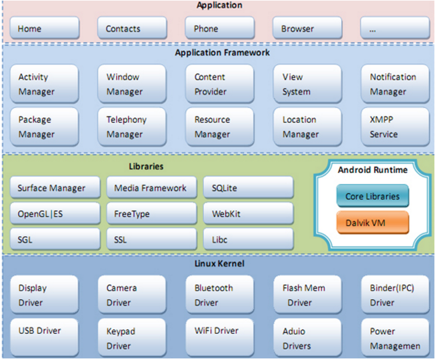
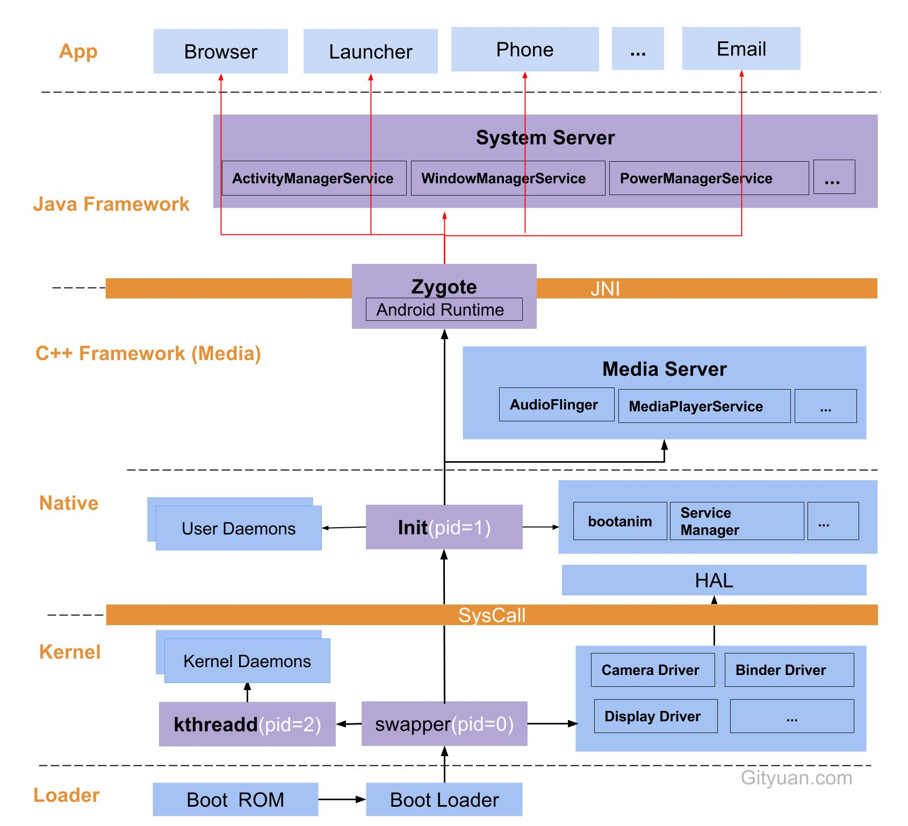

# 一. 引言
Android系统非常庞大、错综复杂，其底层是采用Linux作为基底，上层采用包含虚拟机的Java层以及Native层，通过系统调用(Syscall)连通系统的内核空间与用户空间。用户空间主要采用C++和Java代码，通过JNI技术打通用户空间的Java层和Native层(C++/C)，从而融为一体。

Google官方提供了一张经典的四层架构图，从下往上依次分为Linux内核、系统库和Android运行时环境、框架层以及应用层这4层架构，其中每一层都包含大量的子模块或子系统

 

# 二. Android架构

* 图解： Android系统启动过程由上图从下往上的一个过程：Loader -> Kernel -> Native -> Framework -> App，接来下简要说说每个过程：

### 2.1 Loader层
* Boot ROM: 当手机处于关机状态时，长按Power键开机，引导芯片开始从固化在ROM里的预设出代码开始执行，然后加载引导程序到RAM；
* Boot Loader：这是启动Android系统之前的引导程序，主要是检查RAM，初始化硬件参数等功能。
### 2.2 Kernel层
Kernel层是指Android内核层，到这里才刚刚开始进入Android系统。

* 启动Kernel的swapper进程(pid=0)：该进程又称为idle进程, 系统初始化过程Kernel由无到有开创的第一个进程, 用于初始化进程管理、内存管理，加载Display,Camera Driver，Binder Driver等相关工作；
* 启动kthreadd进程（pid=2）：是Linux系统的内核进程，会创建内核工作线程kworkder，软中断线程ksoftirqd，thermal等内核守护进程。kthreadd进程是所有内核进程的鼻祖。
### 2.3 Native层
这里的Native层主要包括init孵化来的用户空间的守护进程、HAL层以及开机动画等。启动init进程(pid=1),是Linux系统的用户进程，init进程是所有用户进程的鼻祖。

* init进程会孵化出ueventd、logd、healthd、installd、adbd、lmkd等用户守护进程；
* init进程还启动servicemanager(binder服务管家)、bootanim(开机动画)等重要服务
* init进程孵化出Zygote进程，Zygote进程是Android系统的第一个Java进程(即虚拟机进程)，Zygote是所有Java进程的父进程，Zygote进程本身是由init进程孵化而来的。
### 2.4 Framework层
* Zygote进程，是由init进程通过解析init.rc文件后fork生成的，Zygote进程主要包含：
    * 加载ZygoteInit类，注册Zygote Socket服务端套接字；
    * 加载虚拟机；
    * preloadClasses；
    * preloadResouces。
* System Server进程，是由Zygote进程fork而来，System Server是Zygote孵化的第一个进程，System Server负责启动和管理整个Java framework，包含ActivityManager，PowerManager等服务。
* Media Server进程，是由init进程fork而来，负责启动和管理整个C++ framework，包含AudioFlinger，Camera Service，等服务。
### 2.5 App层
* Zygote进程孵化出的第一个App进程是Launcher，这是用户看到的桌面App；
* Zygote进程还会创建Browser，Phone，Email等App进程，每个App至少运行在一个进程上。
* 所有的App进程都是由Zygote进程fork生成的。
### 2.6 Syscall && JNI
* Native与Kernel之间有一层系统调用(SysCall)层，见Linux系统调用(Syscall)原理;
* Java层与Native(C/C++)层之间的纽带JNI，见Android JNI原理分析。

# 三. 通信方式
* 无论是Android系统，还是各种Linux衍生系统，各个组件、模块往往运行在各种不同的进程和线程内，这里就必然涉及进程/线程之间的通信。对于IPC(Inter-Process Communication, 进程间通信)，Linux现有管道、消息队列、共享内存、套接字、信号量、信号这些IPC机制，Android额外还有Binder IPC机制，Android OS中的Zygote进程的IPC采用的是Socket机制，在上层system server、media server以及上层App之间更多的是采用Binder IPC方式来完成跨进程间的通信。对于Android上层架构中，很多时候是在同一个进程的线程之间需要相互通信，例如同一个进程的主线程与工作线程之间的通信，往往采用的Handler消息机制。
* 想深入理解Android内核层架构，必须先深入理解Linux现有的IPC机制；对于Android上层架构，则最常用的通信方式是Binder、Socket、Handler，当然也有少量其他的IPC方式，比如杀进程Process.killProcess()采用的是signal方式。下面说说Binder、Socket、Handler：

### 3.1 为何Android要采用Binder作为IPC机制
1. 管道：在创建时分配一个page大小的内存，缓存区大小比较有限；
2. 消息队列：信息复制两次，额外的CPU消耗；不合适频繁或信息量大的通信；
3. 共享内存：无须复制，共享缓冲区直接付附加到进程虚拟地址空间，速度快；但进程间的同步问题操作系统无法实现，必须各进程利用同步工具解决；
4. 套接字：作为更通用的接口，传输效率低，主要用于不通机器或跨网络的通信；
5. 信号量：常作为一种锁机制，防止某进程正在访问共享资源时，其他进程也访问该资源。因此，主要作为进程间以及同一进程内不同线程之间的同步手段。
6. 信号: 不适用于信息交换，更适用于进程中断控制，比如非法内存访问，杀死某个进程等；
### 3.2 5个角度来分析Binder
1. 从性能的角度 数据拷贝次数：Binder数据拷贝只需要一次，而管道、消息队列、Socket都需要2次，但共享内存方式一次内存拷贝都不需要；从性能角度看，Binder性能仅次于共享内存
2. 从稳定性的角度
    * Binder是基于C/S架构的 C/S 相对独立，稳定性较好
    * 共享内存实现方式复杂，没有客户与服务端之别， 需要充分考虑到访问临界资源的并发同步问题，否则可能会出现死锁等问题
3. 从安全的角度
    * 传统Linux IPC的接收方无法获得对方进程可靠的UID/PID，从而无法鉴别对方身份
        1. 传统IPC只能由用户在数据包里填入UID/PID
        2. 可靠的身份标记只有由IPC机制本身在内核中添加
        3. 传统IPC访问接入点是开放的，无法建立私有通道
    * Android为每个安装好的应用程序分配了自己的UID，故进程的UID是鉴别进程身份的重要标志，前面提到C/S架构，Android系统中对外只暴露Client端，Client端将任务发送给Server端，Server端会根据权限控制策略，判断UID/PID是否满足访问权限，目前权限控制很多时候是通过弹出权限询问对话框，让用户选择是否运行
    * Android的UID权鉴是如何做的？
4. 从语言层面的角度
    * Linux是基于C语言(面向过程的语言)，而Android是基于Java语言(面向对象的语句)
    * Binder恰恰也符合面向对象的思想 Binder模糊了进程边界，淡化了进程间通信过程，整个系统仿佛运行于同一个面向对象的程序之中
    * Android OS中的Zygote进程的IPC采用的是Socket（套接字）机制，Android中的Kill Process采用的signal（信号）机制等等。而Binder更多则用在system_server进程与上层App层的IPC交互。
5. 从公司战略的角度
总所周知，Linux内核是开源的系统，所开放源代码许可协议GPL保护，该协议具有“病毒式感染”的能力，怎么理解这句话呢？受GPL保护的Linux Kernel是运行在内核空间，对于上层的任何类库、服务、应用等运行在用户空间，一旦进行SysCall（系统调用），调用到底层Kernel，那么也必须遵循GPL协议。 而Android 之父 Andy Rubin对于GPL显然是不能接受的，为此，Google巧妙地将GPL协议控制在内核空间，将用户空间的协议采用Apache-2.0协议（允许基于Android的开发商不向社区反馈源码），同时在GPL协议与Apache-2.0之间的Lib库中采用BSD证授权方法，有效隔断了GPL的传染性，仍有较大争议，但至少目前缓解Android，让GPL止步于内核空间，这是Google在GPL Linux下 开源与商业化共存的一个成功典范。
### Binder IPC原理
 
# 四.  系统启动系列


| 序号 | 进程启动 | 概述 |
|---|---|---|
|1   |init进程	|Linux系统中用户空间的第一个进程, Init.main|
|2	|zygote进程|	所有Ａpp进程的父进程, ZygoteInit.main|
|3	|system_server进程|	系统各大服务的载体|
|4	|servicemanager进程|	binder服务的大管家, 守护进程循环运行在binder_loop|
|5	|app进程|	通过Process.start启动App进程, ActivityThread.main |

# 五. AMS
### AMS启动
* 在system_server进程中启动
* SystemServer.java #startBootstrapServices()
* 创建AMS实例对象，创建Andoid Runtime，ActivityThread和Context对象；
* setSystemProcess：注册AMS、meminfo、cpuinfo等服务到ServiceManager；
* installSystemProviderss，加载SettingsProvider；
* 启动SystemUIService，再调用一系列服务的systemReady()方法；
* 发布Binder服务

|服务名	|类名|	功能|
|---|---|---|
|activity	|ActivityManagerService|	AMS|
|procstats	|ProcessStatsService|	进程统计|
|meminfo	|MemBinder|	内存|
|gfxinfo	|GraphicsBinder|	图像信息|
|dbinfo	|DbBinder|	数据库|
|cpuinfo	|CpuBinder|	CPU|
|permission	|PermissionController|	权限|
|processinfo	|ProcessInfoService|	进程服务|
|usagestats|	UsageStatsService|	应用的使用情况|
* 想要查看这些服务的信息，可通过dumpsys <服务名>命令。比如查看CPU信息命令dumpsys cpuinfo

### AMS类图结构
 

* 在这张图中，绿色的部分是在SDK中开放给应用程序开发人员的接口，蓝色的部分是一个典型的Proxy模式，红色的部分是底层的服务实现，是真正的动作执行者。这里的一个核心思想是Proxy模式，我们接下来对此模式加以介绍
#### Proxy模式
* Proxy模式，也称代理模式，是经典设计模式中的一种结构型模式，其定义是为其他对象提供一种代理以控制对这个对象的访问，简单的说就是在访问和被访问对象中间加上的一个间接层，以隔离访问者和被访问者的实现细节。

结合上面的类结构图，其中ActivityManager是一个客户端，为了隔离它与ActivityManagerService，有效降低甚至消除二者的耦合度，在这中间使用了ActivityManagerProxy代理类，所有对ActivityManagerService的访问都转换成对代理类的访问，这样ActivityManager就与ActivityManagerService解耦了。这就是代理模式的典型应用场景。

为了让代理类与被代理类保持一致的接口，从而实现更加灵活的类结构，或者说完美的屏蔽实现细节，通常的作法是让代理类与被代理类实现一个公共的接口，这样对调用者来说，无法知道被调用的是代理类还是直接是被代理类，因为二者的接口是相同的。

这个思路在上面的类结构图里也有落实，IActivityManager接口类就是起的这个作用。

以上就是代理模式的思路，有时我们也称代理类为本地代理（Local Proxy），被代理类为远端代理（Remote Proxy）。

本地代理与远端代理的Binder
我们再来看一下Binder类的作用，Binder的含义可能译为粘合剂更为贴切，即将两侧的东西粘贴起来。在操作系统中，Binder的一大作用就是连接本地代理和远端代理。Binder中最重要的一个函数是：
```
    public final boolean transact(int code, Parcel data, Parcel reply,

            int flags) throws RemoteException {

                   ……

        boolean r = onTransact(code, data, reply, flags);

        if (reply != null) {

            reply.setDataPosition(0);

        }

        return r;

    }
```

它的作用就在于通过code来表示请求的命令标识，通过data和reply进行数据传递，只要远端代理能实现onTransact()函数，即可做出正确的动作，远端的执行接口被完全屏蔽了。

当然，Binder的实现还是很复杂的，不仅是类型转换，还要透过Binder驱动进入KERNEL层来完成进程通信，这些内容不在本文的范围之内，故此处不再深入解析相应的机制。此处我们只要知道Binder的transact()函数实现就可以了。

到此为止，我们对ActivityManager的静态类结构就分析完了，但这还不足以搞清在系统运行中的调用过程，因此，我们以下图的序列图为基础，结合源码探索一下ActivityManager运行时的机制。


我们以ActivityManager的getRunningServices()函数为例，对上述序列图进行解析。
```
    public List<RunningServiceInfo> getRunningServices(int maxNum)

            throws SecurityException {

        try {

            return (List<RunningServiceInfo>)ActivityManagerNative.getDefault()

                    .getServices(maxNum, 0);

        } catch (RemoteException e) {

            // System dead, we will be dead too soon!

            return null;

        }

    }
```
可以看到，调用被委托到了ActivatyManagerNative.getDefault()。
```
    static public IActivityManager asInterface(IBinder obj)

{

                   ……

        return new ActivityManagerProxy(obj);

    }

   

    static public IActivityManager getDefault()

{

……

        IBinder b = ServiceManager.getService("activity");

        gDefault = asInterface(b);

        return gDefault;

    }
```
从上述简化后的源码可以看到，getDefault()函数返回的是一个ActivityManagerProxy对象的引用，也就是说，ActivityManager得到了一个本地代理。

因为在IActivityManager接口中已经定义了getServices()函数，所以我们来看这个本地代理对该函数的实现。
```
    public List getServices(int maxNum, int flags) throws RemoteException {

        Parcel data = Parcel.obtain();

        Parcel reply = Parcel.obtain();

                   ……

        mRemote.transact(GET_SERVICES_TRANSACTION, data, reply, 0);

        ……

    }
```
从这个代码版段我们看到，调用远端代理的transact()函数，而这个mRemote就是ActivityManagerNative的Binder接口。

接下来我们看一下ActivityManagerNative的代码，因为该类是继承于Binder类的，所以transact的机制此前我们已经展示了代码，对于该类而言，重要的是对onTransact()函数的实现。
```
    public boolean onTransact(int code, Parcel data, Parcel reply, int flags)

            throws RemoteException {

        switch (code) {

        case GET_SERVICES_TRANSACTION: {

                            ……

            List list = getServices(maxNum, fl);

                            ……

            return true;

        }

……

        }

        return super.onTransact(code, data, reply, flags);

    }
```
在onTrasact()函数内，虽然代码特别多，但就是一个switch语句，根据不同的code命令进行不同的处理，比如对于GET_SERVICES_TRANSACTION命令，只是调用了getServices()函数。而该函数的实现是在ActivityManagerService类中，它是ActivityManagerNative的子类，对于该函数的实现细节，不在本文中详细分析。

Activity启动
在经过前文的学习以后，我们一起来整理一下Activity的启动机制。就从Activity的startActivity()函数开始吧。

startActivity()函数调用了startActivityForResult()函数，该函数有源码如下：
```
    public void startActivityForResult(Intent intent, int requestCode) {

        ……

            Instrumentation.ActivityResult ar =

                mInstrumentation.execStartActivity(

                    this, mMainThread.getApplicationThread(), mToken, this,

                    intent, requestCode);

                   ……

    }
```
可见，功能被委托给Instrumentation对象来执行了。这个类的功能是辅助Activity的监控和测试，在此我们不详细描述，我们来看它的execStartActivity()函数。
```
    public ActivityResult execStartActivity(

        Context who, IBinder contextThread, IBinder token, Activity target,

        Intent intent, int requestCode) {

                   ……

        try {

            int result = ActivityManagerNative.getDefault()

                .startActivity(whoThread, intent,

                        intent.resolveTypeIfNeeded(who.getContentResolver()),

                        null, 0, token, target != null ? target.mEmbeddedID : null,

                        requestCode, false, false);

            checkStartActivityResult(result, intent);

        } catch (RemoteException e) {

        }

        return null;

    }
```
在这个函数里，我们看到了前文熟悉的ActivityManagerNative.getDefault()，没错，利用了ActivityManagerService。通过前文的线索，利用Proxy模式，我们可以透过ActivityManagerProxy，通过Binder的transact机制，找到真正的动作执行者，即ActivityManagerService类的startActivity()函数，并沿此线索继续追踪源码，在startActivityLocked()函数里边看到了mWindowManager.setAppStartingWindow的语句调用，mWindowManager是WindowManagerService对象，用于负责界面上的具体窗口调试。

通过这样的源码追踪，我们了解到了Activity启动的底层实现机制，也加深了对Proxy模式和Binder机制的理解。

### Android中子线程真的不能更新UI吗？
```
    Process: com.example.amsdemo, PID: 4855
    android.view.ViewRootImpl$CalledFromWrongThreadException: Only the original thread that created a view hierarchy can touch its views.
        at android.view.ViewRootImpl.checkThread(ViewRootImpl.java:6891)
        at android.view.ViewRootImpl.requestLayout(ViewRootImpl.java:1048)
        at android.view.View.requestLayout(View.java:19781)
        at android.view.View.requestLayout(View.java:19781)
        at android.view.View.requestLayout(View.java:19781)
        at android.view.View.requestLayout(View.java:19781)
        at android.view.View.requestLayout(View.java:19781)
        at android.view.View.requestLayout(View.java:19781)
        at android.support.constraint.ConstraintLayout.requestLayout(ConstraintLayout.java:3172)
        at android.view.View.requestLayout(View.java:19781)
        at android.widget.TextView.checkForRelayout(TextView.java:7368)
        at android.widget.TextView.setText(TextView.java:4480)
        at android.widget.TextView.setText(TextView.java:4337)
        at android.widget.TextView.setText(TextView.java:4312)
        at com.example.amsdemo.MainActivity$3.run(MainActivity.java:46)
        
        
        ViewRootImpl.java#checkThread() L 6889
        -> #requestLayout() L 1046
        -> #scheduleTraversals() L 1222
        -> #TraversalRunnable L 6334
        -> #doTraversal() L 1245
        ActivityThread.java#handleResumeActivity() L 3456
        -> #performResumeActivity() L 3385
        Activity.java#performResume() L 6774
        Instrumentation.java#callActivityOnResume() L 1267
        //performResumeActivity方法确实是回调onResume方法的入口
        ActivityThread.java#handleResumeActivity() L 3560
        Activity.java#makeVisible() L 5128
        WindowManagerImpl.java#addView() L 91
        WindowManagerGlobal.java#addView() L 263
        -> addView() L 331
        
        
        
```


android中进程的层次如下（重要性由高到低）：

1、前端进程。顾名思义，前端进程就是目前显示在屏幕上和用户交互的进程，在系统中前端进程数量很少，而这种进程是对用户体验的影响最大，只有系统的内存稀少到不足以维持和用户的基本交互时才会销毁前端进程。因此这种进程重要性是最高的。

2、可见进程。可见进程也拥有一个可视化的界面，只是目前不是最上层界面（最上层界面在前端进程里面），可见进程一般调用了OnPause()，可见进程比前端进程重要性低，但是在交互方面影响还是很大，因为用户可能随时切换过去，所以系统不会轻易销毁它。

3、服务进程。一个服务进程就是一个Service，它调用了startService()，就是UNIX中说的守护进程，对用户不可见，但是保证了一些重要的事件被监听或者维持着某些状态，比如网络数据传输、后台音乐播放，这类进程在内存不足且为了保证前端交互的顺利进行的时候被销毁。

4、后台进程。这里叫后台进程可能会和一般意义上的后台进程混淆，要说明的是，android里的后台进程是调用了OnStop()的，可以理解成用户暂时没有和这个进程交互的愿望，所以这里后台进程有点“待销毁”的意思。

5、空进程。这是一种系统缓存机制，其实就是个进程的外壳，当有新进程创建的时候，这个空进程可以加快进程创建速度，当系统内存不足的时候，首先销毁空进程。


